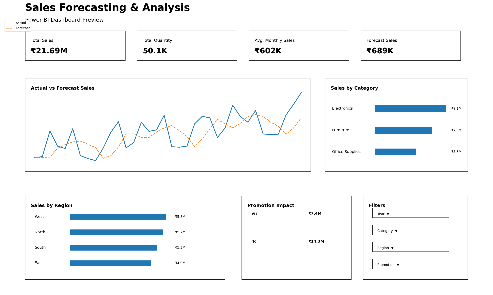

# 📊 Sales Forecasting & Analysis

## 📌 Project Overview

This project focuses on analyzing historical sales data to understand **sales trends, seasonal patterns, category performance, regional performance, and promotional impact**. It also includes sales forecasting to estimate future sales based on historical patterns.

The project combines **Advanced Excel, SQL, and Power BI** to demonstrate an end-to-end data analytics workflow.

## 🎯 Objectives

* Analyze historical sales performance
* Identify monthly and yearly sales trends
* Analyze category-wise and region-wise performance
* Evaluate the impact of promotions and holidays on sales
* Identify seasonal sales patterns
* Perform sales forecasting using historical sales data
* Create business-focused visualizations and insights

## 🛠️ Tools & Technologies

| Tool               | Purpose                                                            |
| ------------------ | ------------------------------------------------------------------ |
| **Advanced Excel** | Data cleaning, PivotTables, PivotCharts, analysis, and forecasting |
| **SQL**            | Data querying, aggregation, filtering, and trend analysis          |
| **Power BI**       | Interactive dashboard and business visualization                   |

## 📊 Dataset

The dataset contains monthly sales records from **January 2023 to December 2025**.

### Dataset Fields

* **Date** – Sales date
* **Category** – Product category
* **Region** – Sales region
* **Quantity** – Units sold
* **Average Price** – Average selling price
* **Promotion** – Promotion status
* **Holiday** – Holiday indicator
* **Sales** – Total sales value

The dataset covers three product categories across four regions.

## 🔍 Analysis Performed

### 📗 Advanced Excel

* Data cleaning and formatting
* Monthly sales analysis
* Category-wise sales analysis
* Region-wise sales analysis
* Promotion impact analysis
* PivotTables and PivotCharts
* Moving-average forecasting
* Actual vs Forecast analysis
* KPI summary

### 🗄️ SQL

SQL queries were used to analyze:

* Total sales and quantity
* Monthly sales trends
* Yearly sales performance
* Category performance
* Regional performance
* Promotion impact
* Holiday impact
* Monthly category performance
* Quarterly sales performance

### 📈 Sales Forecasting

Historical monthly sales data was analyzed to identify trends and estimate future sales.

A **3-month moving average** is used as a simple and explainable forecasting baseline.

The analysis includes:

* Historical sales trends
* Monthly patterns
* Moving-average forecast
* Actual vs Forecast comparison

## 📊 Power BI Dashboard

The Power BI dashboard is designed to provide an interactive overview of sales performance.

### Dashboard Includes

* Total Sales KPI
* Total Quantity KPI
* Average Monthly Sales
* Forecast Sales
* Monthly Sales Trend
* Actual vs Forecast Sales
* Sales by Category
* Sales by Region
* Promotion Impact
* Interactive filters for Year, Category, Region, and Promotion

### Dashboard Preview



## 🔄 Project Workflow

```text
Raw Sales Data
       ↓
Data Cleaning & Preparation
       ↓
Advanced Excel Analysis
       ↓
SQL Analysis
       ↓
Sales Forecasting
       ↓
Power BI Visualization
       ↓
Business Insights
```

## 💡 Key Business Areas

This project helps analyze:

* Sales growth and trends
* Product category performance
* Regional performance
* Promotional impact
* Seasonal patterns
* Future sales expectations

These insights can support **sales planning, inventory management, and business decision-making**.

